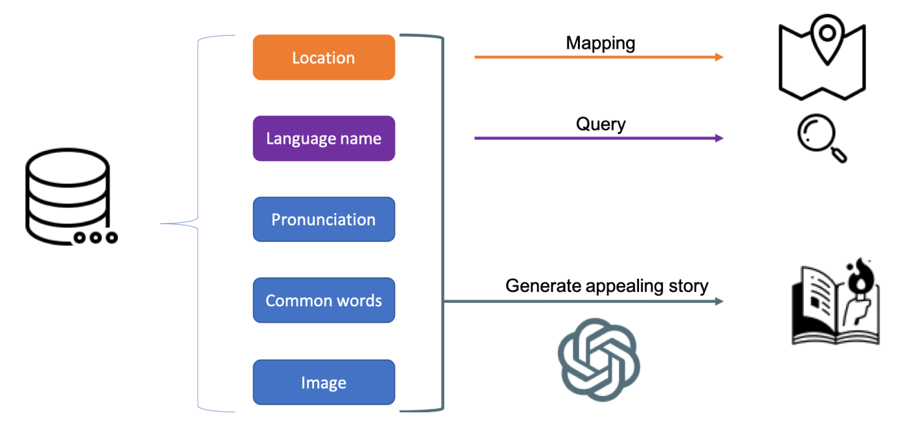
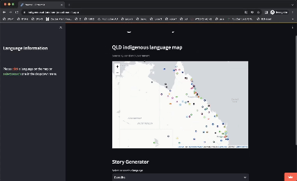

# Indigenous Storyteller

## Unleashing the Power of Open Data with Generative AI

### Project Overview
<div style="text-align: center;">
  
</div>

Indigenous Storyteller is a unique project that taps into the power of Open Data and Generative AI to create informative, engaging, and immersive stories based on indigenous cultures. Focusing on Australian indigenous languages, the project uses an open-source dataset provided by the Queensland government, which contains a wealth of information on the local indigenous tongues.

Currently, AI has limited comprehension of these languages due to scarcity of data. This project aims to bridge this gap by providing AI with the necessary data to understand and interpret these languages effectively.

The data input to the system includes language name, pronunciation, common words, geographical locations, images, and other related information. While AI may not produce informative contents independently, this additional data allows it to weave fascinating narratives based on indigenous culture, highlighting the uniqueness and diversity of different tribes' languages and cultures.

### Objectives
<div style="text-align: center;">
  
</div>

* To create an interactive learning platform for people interested in learning indigenous languages
* To help indigenous people rediscover, embrace, and preserve their cultural identity
* To advance AI capabilities in language comprehension, particularly less-documented indigenous languages

**The website is already deployed in the following [link](https://gov-hack-indigenous-ai.streamlit.app/).**

### Set Up

To set up the project locally follow the instructions given below

1. Clone the Repo

```bash
git clone https://github.com/jasonthewhale/Indigenous_AI
cd Indigenous_AI
```
2. Create a Virtual Environment

```bash
python3 -m venv venv
source venv/bin/activate
```

2. Install Dependencies

```bash
pip install -r requirements.txt
```

3. Run Application

```bash
streamlit run st_main.py
```

### Collaborations and Contributions

We sincerely welcome collaborations and contributions to this project. If you have any suggestions for improvements or wish to contribute, please feel free to open an issue or a pull request.

### License

Indigenous Storyteller is distributed under the MIT license.

### Acknowledgements

This project was inspired by the necessity to preserve the valuable cultural heritage embedded in indigenous languages. We wish to acknowledge the support of the Queensland government in providing the open-source dataset that helped bring this project to life.

### Team
- Junchen You
- OpenAI August 19 version (GPT-3.5 & GPT-4)
